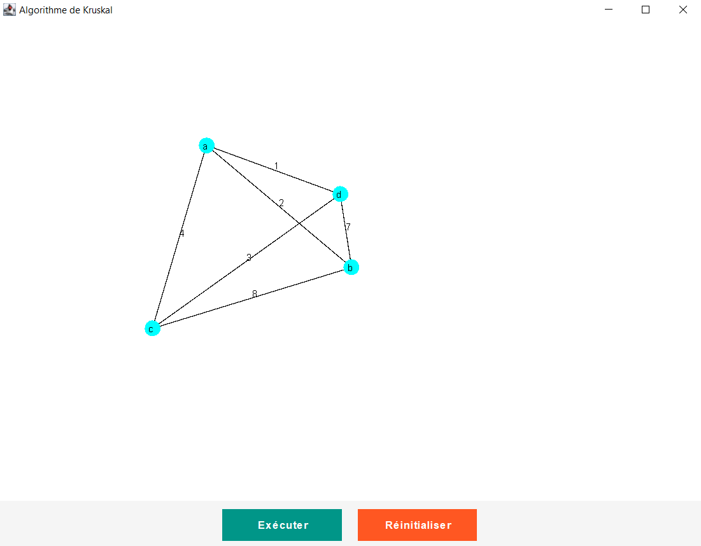
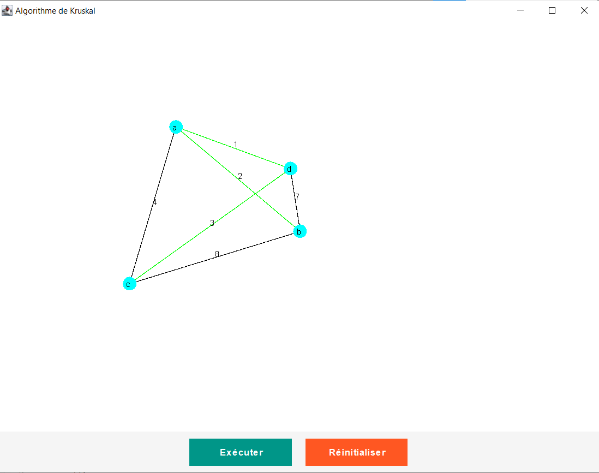

# Kruskal's Algorithm Implementation in Java

 

This project implements Kruskal's algorithm to find the **Minimum Spanning Tree (MST)** of a graph. The program includes both a console-based version and a graphical user interface (GUI) for visualizing the graph and its MST.

## Table of Contents

1. [Overview](#overview)
2. [Features](#features)
3. [Prerequisites](#prerequisites)
4. [Installation](#installation)
5. [Usage](#usage)
   - [Console Application](#console-application)
   - [Graphical User Interface (GUI)](#graphical-user-interface-gui)
6. [Code Structure](#code-structure)
7. [Contributing](#contributing)
8. [License](#license)

---

## Overview

Kruskal's algorithm is a greedy algorithm used to find the Minimum Spanning Tree (MST) of a connected, undirected graph. The MST is a subset of edges that connects all vertices with the minimum possible total edge weight.

This implementation provides two modes:
1. **Console-based Application**: Allows users to input vertices and edges manually via the terminal.
2. **GUI Application**: Provides an interactive interface to add vertices and edges visually, run the algorithm, and display the MST.
Here is an example of the GUI interface:

---

## Features

- **Console Mode**:
  - Input vertices and edges manually.
  - Outputs the edges of the MST along with their weights.
  - Handles errors gracefully (e.g., invalid inputs).

- **GUI Mode**:
  - Add vertices by clicking on the graph panel.
  - Add weighted edges between vertices.
  - Visualize the graph and highlight the MST edges.
  - Reset the graph and rerun the algorithm.
Here is an example of the MST visualization:

---

## Prerequisites

To run this project, you need the following:

- **Java Development Kit (JDK)**: Version 17 or higher.
- **Build Tool**: Ensure you have a compatible IDE or build tool like IntelliJ IDEA, Eclipse, or Maven.
- **Git**: To clone the repository (optional).

---

## Installation

1. Clone the repository:
   ```bash
   git clone https://github.com/your-username/kruskal-algorithm.git
   cd kruskal-algorithm
   ```

2. Compile the code:
   - If using an IDE, import the project and compile it directly.
   - If using the command line:
     ```bash
     javac kruskal/*.java
     ```

3. Run the application:
   - For the console application:
     ```bash
     java kruskal.Kruskal
     ```
   - For the GUI application:
     ```bash
     java kruskal.KruskalGUI
     ```

---

## Usage

### Console Application

1. Launch the console application:
   ```bash
   java kruskal.Kruskal
   ```

2. Follow the prompts:
   - Enter the number of vertices.
   - Provide names for each vertex.
   - Enter the number of edges and their details (source, destination, weight).

3. View the output:
   - The program will display the edges of the MST and their total weight.

### Graphical User Interface (GUI)

1. Launch the GUI application:
   ```bash
   java kruskal.KruskalGUI
   ```

2. Use the interface:
   - Click on the graph panel to add vertices.
   - Select two vertices to add an edge with a specified weight.
   - Click "Exécuter" to run Kruskal's algorithm and visualize the MST.
   - Click "Réinitialiser" to reset the graph.

---

## Code Structure

The project is organized into the following components:

- **`Kruskal.java`**:
  - Implements the core logic of Kruskal's algorithm.
  - Includes utility methods for union-find operations and sorting edges.

- **`KruskalGUI.java`**:
  - Provides a graphical interface for interacting with the algorithm.
  - Handles mouse events for adding vertices and edges.
  - Displays the graph and highlights the MST edges.

- **`Arete.java`**:
  - Represents an edge in the graph with source, destination, and weight.

- **`SousEnsemble.java`**:
  - Represents a subset for union-find operations.

---

## Contributing

Contributions are welcome! Here's how you can contribute:

1. Fork the repository.
2. Create a new branch (`git checkout -b feature/YourFeatureName`).
3. Commit your changes (`git commit -m "Add a new feature"`).
4. Push to the branch (`git push origin feature/YourFeatureName`).
5. Open a pull request.

Please ensure your code adheres to the existing style and includes appropriate documentation.

---

## License

This project is licensed under the **MIT License**. See the [LICENSE](LICENSE) file for details.

---

## Acknowledgments

- Inspiration from classic graph theory algorithms.
- Built with Java Swing for the GUI.

---

